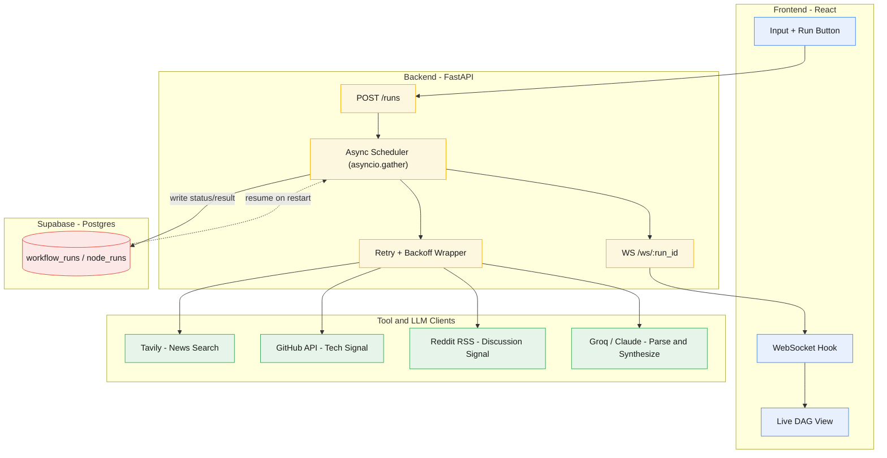

# Threadwright — Async DAG Orchestration Engine

[](https://threadwright.vercel.app/)
[](https://threadwright.onrender.com/health)

An asynchronous, directed acyclic graph (DAG) workflow engine built from the ground up to orchestrate parallel data-gathering pipelines. It processes concurrent web, developer, and social inputs to generate targeted corporate research dossiers and candidate interview preparation blueprints.

---

# Project Overview

Threadwright is a custom-engineered orchestrator designed to solve the latency bottlenecks of sequential agent systems. Instead of processing task chains linearly, the system evaluates dynamic node dependencies and executes independent execution paths concurrently. 

The engine compiles diverse, live intelligence streams (web search, active GitHub repositories, and Reddit public discussions) alongside user-pasted job descriptions. It then uses structured Large Language Model synthesis to output a comprehensive preparation dossier covering market competition, entry-level hiring trends, compensation statistics (LPA), core technical evaluation domains, and custom-tailored portfolio projects.

---

# Core Features

- **Concurrent Graph Scheduling:** Orchestrates task dependencies as an in-memory directed acyclic graph, running non-dependent tasks in parallel to reduce end-to-end execution latency.

- **Idempotency & Crash-Resume:** Persists detailed state transitions in PostgreSQL. If the process is terminated mid-run, it restarts precisely from the point of failure without re-executing already-completed upstream tasks.

- **Thread-Safe I/O Isolation:** Wraps synchronous, blocking SDK actions within dedicated worker threads to protect the primary asynchronous event loop from blocking.

- **Dynamic Fault Injection & Backoff:** Simulates downstream network degradation on command. Automatically applies exponential backoff with randomized jitter to manage retries programmatically.

- **Event-Driven WebSocket Streaming:** Broadcasts task status updates to connected client interfaces immediately upon database state changes.

---

# System Architecture & Tech Stack

Threadwright decouples the client state, the orchestration engine, and external API connectors using an event-driven, database-backed architectural flow.



---

### UI Demo Showcase
<div align="center">
  <!-- Place your product UI screenshots or Gifs here -->
   
</div>

---

### Tech Stack Details

| Architecture Layer | Technology | Engineering Purpose |
| :--- | :--- | :--- |
| **Orchestration & Core Engine** | **Python Asyncio & FastAPI** | Async DAG execution, background task spawning, and WebSocket communication. |
| | **SQLAlchemy & Asyncpg** | Async PostgreSQL database communication and transaction management. |
| **Database & Persistence** | **Supabase (PostgreSQL)** | Persistent storage for run workflows, execution tracking, and state logs. |
| **Intelligence Services** | **Tavily Search API** | Real-time targeted web and market competitor retrieval. |
| | **GitHub REST API** | Developer engagement analysis and active source tracking. |
| | **Reddit Public RSS Feed** | Social sentiment and salary discussions parsing without API overhead. |
| **Cognitive Inference** | **Anthropic Claude API** | High-context structured corporate brief synthesis. |
| | **Groq Llama-3.3-70b** | Lower-latency fallback engine for parsing and generation. |

---

# Engineering Challenges & Architectural Solutions

### Highlight 1: Native Asynchronous DAG Scheduling via `asyncio.gather`

- **The Problem:** Sequential execution of search tools (Tavily, GitHub, and Reddit) and LLM tasks introduces cumulative network latency, resulting in poor performance on standard sequential pipelines.
- **The Solution:** Implemented an in-memory dependency resolver in the scheduler. The loop evaluates node dependencies, identifies active run paths, and schedules all eligible nodes concurrently using `asyncio.gather`. 

```python
# scheduler.py execution slice
ready = [
    n for n in remaining.values()
    if all(dep in completed for dep in n.depends_on)
]

# Non-blocking concurrent execution of all ready tasks
await asyncio.gather(*[
    _execute_node(workflow_run_id, n, node_registry, run_input, results)
    for n in ready
])
```

---

### Highlight 2: Database-Enforced Transaction Boundaries for Crash-Resume

- **The Problem:** Mid-run server crashes or restarts can corrupt the current state machine, leading to lost progress or costly redundant calls to external APIs.
- **The Solution:** Bound state writes and results storage to unified, transactional database updates. The system maps nodes to a unique constraint combination of `(workflow_run_id, node_id)`. Upon crash recovery, the scheduler queries the completed run table, loads the completed node outputs, and safely bypasses them during resumption.

```sql
-- Enforcing state machine boundary at the schema level
ALTER TABLE node_runs 
ADD CONSTRAINT unique_node_run UNIQUE (workflow_run_id, node_id);
```

---

### Highlight 3: Delegated Threading for Synchronous SDK Blockers

- **The Problem:** Third-party libraries (such as the Python Reddit API Wrapper `praw`) are synchronous and block execution. Calling them directly inside async code halts the main event loop and stalls all concurrent tasks.
- **The Solution:** Abstracted the execution of blocking calls to an isolated system thread pool using `asyncio.to_thread`. This allows the event loop to schedule other non-blocking tasks concurrently.

```python
# reddit_client.py
# Delegating the blocking search call to a separate worker thread
posts = await asyncio.to_thread(_sync_praw_search, query)
```

---

### Highlight 4: Multi-Provider LLM Fallback with Structured JSON Extraction

- **The Problem:** Relying on a single AI provider exposes the execution flow to rate-limit lockouts or key authorization errors, which halts downstream synthesis.
- **The Solution:** Configured a dual-engine API wrapper. It prioritizes Anthropic (Claude-3-Haiku) and instantly falls back to Groq (Llama-3.3-70b-versatile) on authorization or service exceptions. The system forces JSON-mode schema outputs and applies regex sanitization to remove common markdown wrapper artifacts prior to parsing.

---

### Highlight 5: Stateful Fault Injection and Self-Healing Validation

- **The Problem:** Simulating and verifying backoff schedules and downstream API failures during live product reviews is traditionally unpredictable and difficult to test manually.
- **The Solution:** Built a declarative fault-injection layer directly into the engine. When the `inject_failure` flag is received from the client, the target node intercepts its first two execution attempts, registers synthetic failure transitions in the database, and triggers the exponential backoff timeline (with jitter). On the third attempt, it permits the real execution to pass, demonstrating self-healing recovery.

---

# System Performance & Latency

The parallel orchestration design prioritizes low-latency processing of concurrent operations, minimizing idle wait time during third-party API lookups.

| Operation / Step | Latency (Avg) | Performance Profile & Engineering Notes |
| :--- | :--- | :--- |
| **Parallel Discovery Stage** | ~1.5 - 2.8s | Concurrently executes Tavily, GitHub, and Reddit RSS searches. |
| **Primary LLM Parser** | ~1.2 - 2.5s | Compiles job data asynchronously alongside the discovery stage. |
| **Synthesis Phase** | ~2.5 - 4.5s | Compiles and builds the finalized structured candidate dossier. |
| **Total Engine Overhead** | ~15 - 40ms | Internal routing, state locks, database commits, and broadcast times. |
| **Total Pipeline (No Fault)** | **~5.5 - 9.8s** | Complete execution of all 5 nodes concurrently. |
| **Total Pipeline (With Fault)**| **~11.2 - 15.4s** | Accounts for 2 sequential simulated timeouts, backoffs, and successful recovery. |

---

# Repository Structure

```
threadwright/
│
├── backend/
│   ├── app/
│   │   ├── main.py
│   │   ├── config.py
│   │   ├── models.py
│   │   ├── db.py
│   │   ├── scheduler.py
│   │   ├── websocket_manager.py
│   │   ├── tools/
│   │   │   ├── tavily_client.py
│   │   │   ├── github_client.py
│   │   │   ├── reddit_client.py
│   │   │   └── llm_client.py
│   │   └── routes/
│   │       ├── runs.py
│   │       └── ws.py
│   └── requirements.txt
│
├── frontend/
│   ├── src/
│   │   ├── components/
│   │   ├── hooks/
│   │   ├── App.jsx
│   │   └── main.jsx
│   └── package.json
│
├── supabase/
│   └── schema.sql
│
└── README.md
```

---

# Environment Configuration

To operate the backend engine, configure the following variables in your local `.env` environment:

```ini
DATABASE_URL=postgresql+asyncpg://postgres:[password]@[host]:5432/postgres
TAVILY_API_KEY=your_tavily_api_key
GITHUB_TOKEN=your_github_access_token
REDDIT_CLIENT_ID=your_reddit_client_id
REDDIT_CLIENT_SECRET=your_reddit_client_secret
REDDIT_USER_AGENT=your_reddit_user_agent
GROQ_API_KEY=your_groq_api_key
ANTHROPIC_API_KEY=your_anthropic_api_key
```

---

# Future Improvements

- **Execution Path Pruning:** Skip execution of branches whose input criteria do not change across successive runs.
- **Server-Sent Event Streaming:** Introduce SSE support for standard API interactions as an alternative to WebSockets.
- **Distributed Memory Store:** Migrate global active worker dicts to Redis to scale horizontally across multiple instances.

---

# Author

**Harshal Sharma**  
AI / ML Engineer | Full-Stack AI Systems  

GitHub: [https://github.com/Harshalsharma05](https://github.com/Harshalsharma05)  
LinkedIn: [https://www.linkedin.com/in/harshal-sharma-98851b2ab](https://www.linkedin.com/in/harshal-sharma-98851b2ab)